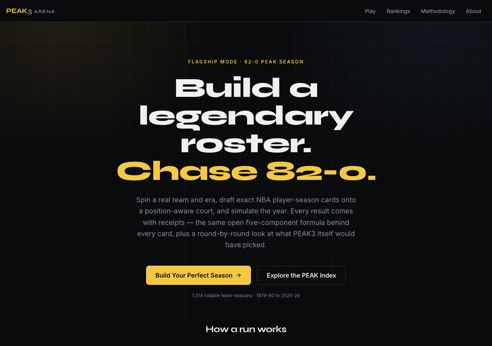
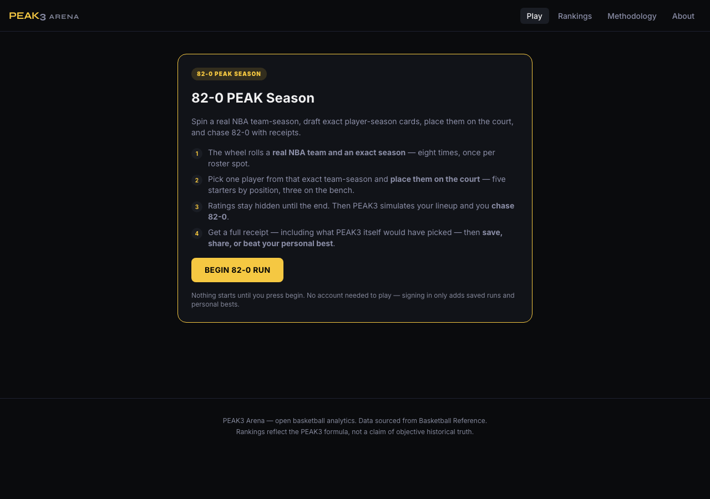
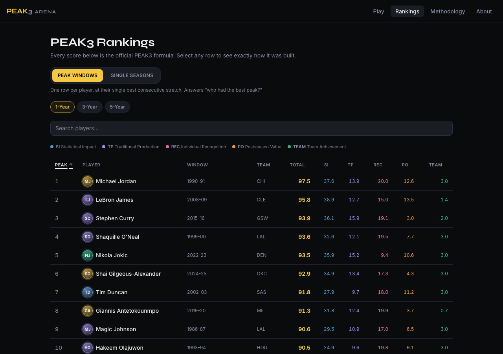
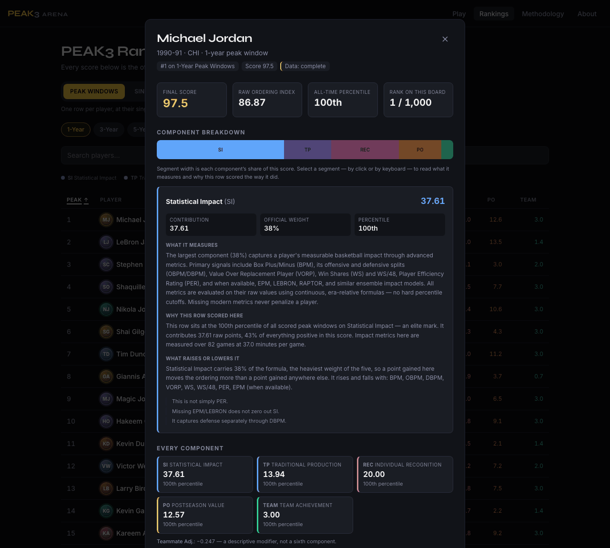
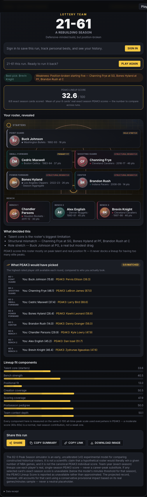

# PEAK3 Arena

A basketball analytics game built on the PEAK3 peak-evaluation model. Spin a
real NBA team-season, draft the exact player-seasons that were actually on that
roster, place them on a position-aware court, and see what the model projects
your lineup would do over 82 games.

Underneath the game is `peak3`: a transparent five-component model that scores
every qualifying player-season from Basketball Reference data (1979-80 through
2025-26) and finds each player's best consecutive window.

---

## Product overview

PEAK3 Arena has two halves that share one scoring engine.

**The game.** The flagship mode is *82-0 PEAK Season*. A reel rolls a real
franchise and a real season — eight times, once per roster spot. Each roll gives
you the actual players from that exact team-season, and you pick one and assign
them a position. Ratings stay hidden until you commit the lineup. Then the model
scores what you built and projects a win-loss record, with a full receipt: which
components carried the roster, where the positional fit broke, and which player
the model itself would have taken in each round.

**The analytics surface.** The Rankings section exposes the same model directly:
every scored peak window and every scored single season, sortable by any of the
five components, with a per-row breakdown explaining how that score was
assembled and where it sits in the all-time distribution.

The design goal for both halves is that no number appears without an
explanation attached. Rankings are presented as what the PEAK3 formula produces,
not as a claim about objective historical truth.

---

## Current feature set

**82-0 PEAK Season (flagship)**

- Exact team-season boards: the eight rolls are real franchise-seasons, and
  candidates are the players who were actually on that roster that year.
- An explicit start gate — navigating to the mode never consumes a run.
- Position-aware court with five starters by position and three bench slots;
  cards can be moved between slots without re-spinning.
- Ratings hidden until the lineup is committed.
- Result receipt: projected record, lineup score, per-component fit bars,
  positional-fit and structural-mismatch findings, and a round-by-round
  comparison against the model's own highest-rated available pick.
- Cards whose exact season falls below the model's minutes threshold are
  reported as unavailable rather than approximated, and contribute a
  conservative provisional impact based on their real games/minutes — never a
  neutral placeholder.
- Downloadable scorecard image, shareable result links, and copyable summaries.
- Daily challenge: a date-derived seed, so everyone gets the same eight rolls
  and the same candidate pools on a given day.
- Saved runs, personal bests, and run history for signed-in users. Play itself
  never requires an account.

**Rankings**

- Two boards: *Peak Windows* (one row per player at their best consecutive
  1-, 3-, or 5-year stretch) and *Single Seasons*.
- Sortable by total score or by any individual component.
- Per-row explanation panel: each component's raw contribution, its official
  weight, its all-time percentile, what the component measures, and what raises
  or lowers it.
- Search, and comparison rails for pivoting between rows without leaving the
  panel.
- Both boards apply a 25 MPG floor on the ranked season. Statistical Impact is
  ~74 % per-minute rate in practice, so without a workload floor efficient
  bench players interleave with starters. Excluded seasons are still fully
  scored and still reachable in 82-0 — they are just not ranked. The model's
  known open defects are listed in
  [`docs/model/SCORING_METHODOLOGY.md`](docs/model/SCORING_METHODOLOGY.md) §15.

**Elsewhere**

- Interactive methodology explorer at `/methodology`.
- Optional accounts (Supabase Auth), progression (XP, levels, streaks,
  achievements, personal records), and public profiles.
- Earlier prototypes — Peak Duel and the 5-player Peak Draft modes — remain
  reachable at `/play/daily`, `/play/endless`, and `/arena/labs`. They are not
  part of the main product path.

Several systems ship behind default-off flags; see
[Feature flags](#feature-flags).

---

## Screenshots

Captured from a local dev build with external asset URLs disabled, so no
third-party player photographs or team logos appear. Player names, seasons, and
statistics are real data from the committed dataset.

| Landing page | The 82-0 start gate |
|---|---|
|  |  |

| Rankings, sortable by any component | Per-row score explanation |
|---|---|
|  |  |



The result receipt from one real run: projected record, lineup score, the
revealed roster with positional-fit findings, the model's own round-by-round
picks, and the component breakdown. This run projected 21-61 — a genuine
outcome of a poorly constructed roster, not a curated best case.

To regenerate these images, from `apps/web`:

```bash
npx playwright test --config=playwright.screenshots.config.ts
```

That config starts the API with `PEAK3_ENABLE_EXTERNAL_ASSET_URLS=false` and
refuses to write a frame if the API is serving external asset URLs.

---

## Scoring methodology

Every score in the product comes from one formula with fixed weights:

| Component | Weight | What it measures |
|---|---|---|
| Statistical Impact | 38% | Advanced impact metrics — BPM and its offensive/defensive splits, VORP, Win Shares and WS/48, PER, and modern ensemble models where available |
| Traditional Production | 21% | Box-score production, era-relative |
| Individual Recognition | 20% | MVP, All-NBA, All-Star, All-Defense and similar honors |
| Postseason Value | 18% | Individual playoff performance |
| Team Achievement | 3% | Team results |

A separate teammate adjustment is reported as a descriptive modifier, not as a
sixth component.

The raw weighted sum is a *prime index*; a monotonic calibration maps it to the
0-100 *prime score* shown in the UI. Because the mapping is monotonic, it never
reorders players.

Two things worth stating plainly:

- **This is a model, not a verdict.** The weights encode a particular view of
  what "peak" means. The product says "PEAK3 rates…" and "the model gives…"
  precisely because a different defensible weighting would produce a different
  ordering.
- **Missing data is not filled in.** Metrics that do not exist for an era are
  handled by era-relative formulas rather than substituted values, and a player
  is never penalized for a metric that was not recorded during their career.
  Where a season falls below the serving threshold, the UI reports the score as
  unavailable instead of estimating one.

The 82-0 projection is a separate, explicitly experimental (v0) lineup model. It
is not the PEAK3 individual score and is labeled as uncalibrated in the UI.

Full detail: [`docs/model/SCORING_METHODOLOGY.md`](docs/model/SCORING_METHODOLOGY.md)
for the component-by-component reference and CLI, and
[`METHODOLOGY.md`](METHODOLOGY.md) for the deepest derivation.

---

## Data notes

- **Source.** Basketball Reference, covering 1979-80 through 2025-26 (the
  three-point era onward). Scraping happens offline via the CLI and is cached;
  it never runs during a web request.
- **Authoritative rankings.** The committed CSVs in `leaderboards/` are the
  canonical output. `scripts/build_web_dataset.py` reads from those files with
  no network access and validates its output before writing anything: it aborts
  on NaN or infinite values, on duplicate window IDs, or if a rank-1 regression
  check against the CSVs fails.
- **Generated, not committed.** `data/web/` is produced by the exporter and is
  gitignored. `make build-dataset` is required after cloning.
- **Rebuilding from scratch.** Regenerating the leaderboards themselves needs
  `cache/processed/`, which is also gitignored.
- **No images in the repo.** `data/game/assets/` holds URL *manifests* only,
  and they are served solely when `PEAK3_ENABLE_EXTERNAL_ASSET_URLS` is
  explicitly enabled. Default-off, and off in CI. Player avatars fall back to
  initials and teams to plain text.
- **Scores are never computed in TypeScript.** The web app renders
  pre-generated values; the model layer is the only thing that scores.

---

## Local development

CI builds against Python 3.12 and Node 20.

```bash
# Install model, API, and web dependencies
make install

# Generate the dataset the API serves (required before first run)
make build-dataset
```

Then run the two services in separate terminals, API first — the web app expects
it on port 8000.

The flagship mode sits behind default-off flags, so local development needs them
set explicitly. From the repository root:

```bash
PEAK3_COURTBUILDER_ENABLED=true \
PEAK3_COURTBUILDER_TEAM_SPIN_ENABLED=true \
PEAK3_COURTBUILDER_READINESS_LEVEL=internal_dev \
PEAK3_ENABLE_EXTERNAL_ASSET_URLS=false \
PEAK3_COURTBUILDER_LEADERBOARD_ENABLED=false \
python3 -m uvicorn app.main:app --app-dir apps/api --reload --port 8000
```

`make api` also works, but starts the API with every flag at its default, which
leaves 82-0 PEAK Season disabled.

In a second terminal:

```bash
make web     # Next.js on http://localhost:3000
```

### Feature flags

All are read with the `PEAK3_` prefix and default to off unless noted.

| Flag | Default | Effect |
|---|---|---|
| `COURTBUILDER_ENABLED` | off | Enables 82-0 PEAK Season |
| `COURTBUILDER_TEAM_SPIN_ENABLED` | off | Enables the team-season reel |
| `COURTBUILDER_READINESS_LEVEL` | `disabled` | Reported readiness; validated against the flags above |
| `COURTBUILDER_EXPERIMENTAL_TEAM_YEAR_ENABLED` | **on** | Exact team-season boards |
| `COURTBUILDER_LEADERBOARD_ENABLED` | off | 82-0 leaderboard submissions |
| `ENABLE_EXTERNAL_ASSET_URLS` | off | Serves third-party headshot and logo URLs |
| `RANKED_*` | off | Ranked queues, matchmaking, rating writes, public leaderboard |
| `DEV_TOOLS_ENABLED` | off | Local-only debug endpoints |

Supabase (`SUPABASE_URL`, `SUPABASE_ANON_KEY`, `SUPABASE_JWT_SECRET`) is
optional. Without it, accounts and progression are unavailable and the game
still plays anonymously. `PEAK3_SIGNING_SECRET` signs session tokens and must be
set to a real value outside local development. Copy `apps/api/.env.example` as a
starting point; never commit a `.env` file.

---

## Useful routes

| Route | Description |
|---|---|
| `/` | Landing page |
| `/arena/court/practice/apex_1y` | 82-0 PEAK Season — the main entry point |
| `/arena/court/daily/apex_1y` | Today's shared daily challenge |
| `/arena/court/history` | Saved runs and personal bests |
| `/arena/court/results/[id]` | A shared or saved run result |
| `/arena` | Arena hub |
| `/rankings` | Peak Windows and Single Seasons boards |
| `/players/[slug]` | Player profile with component breakdown |
| `/methodology` | Interactive formula explorer |
| `/about` | Model transparency and provenance |
| `/profile`, `/u/[handle]` | Account and public profile |
| `/arena/labs` | Earlier prototype modes, not part of the main path |

---

## Testing

```bash
make test        # model + lineup + API + web unit
make test-fast   # adds board-generation checks
make test-full   # adds Playwright end-to-end
```

Individual suites:

```bash
python -m pytest tests/                     # model
python -m pytest apps/api/tests/            # API
cd apps/web && npm run test                 # frontend unit (vitest)
cd apps/web && npx playwright test          # end-to-end
cd apps/web && npm run lint                 # eslint
cd apps/web && npx tsc --noEmit             # typecheck
```

Current counts, all passing:

| Suite | Count |
|---|---|
| Python model | 235 |
| API (FastAPI) | 652 passing, 18 skipped |
| Frontend unit (vitest) | 274 |
| Playwright end-to-end | chromium and mobile-chrome projects; `@mobile`-tagged tests run on the mobile project |

End-to-end tests need both services running; Playwright starts them itself via
its `webServer` config. Accessibility checks run through axe-core and assert no
critical or serious violations.

Model test expectations are treated as fixed. Regression tests verify that the
generated web dataset still matches the canonical CSVs: rank 1 for the 1-year
and 5-year boards, 1-year top-10 ordering, sequential ranks, finite component
contributions, and no duplicate IDs.

---

## Project status

The 82-0 PEAK Season loop is the current focus and is playable end to end:
spin, draft, position, simulate, receipt, save, share. Rankings have a complete
two-board explainability layer.

Recent work, in order: saved runs and personal bests with a daily-challenge
foundation; a rebuilt spin animation and an explicit start gate; a position
model with slot swapping; honest handling of unscored and low-minute cards; the
rankings overhaul; and consolidation of the main play path onto the flagship
mode.

Near-term:

- Calibrate the 82-0 lineup projection. It is explicitly v0 and labeled
  uncalibrated in the UI.
- Split the rankings explain payload. The API currently holds a large artifact
  resident to serve a much smaller response.
- Bound the postseason component on tiny playoff samples. A 20-minute playoff
  run can currently out-score the median Finals-length run; contained today by
  the component's 0.18 weight and the rankings minutes floor, but not fixed.
  Measurements and the fix plan are in
  `tests/test_postseason_sample_invariant.py`.
- Promote 82-0 past `internal_dev` readiness, which gates the leaderboard.

Deliberately deferred: friends and social feeds, live NBA scores, licensed
player photography, native mobile apps, AI-generated commentary, and payments.

Direction and open questions:
[`docs/game-design/NEXT_MODE_ROADMAP.md`](docs/game-design/NEXT_MODE_ROADMAP.md).
Architecture decisions are recorded as ADRs in
[`docs/architecture/`](docs/architecture/).

---

## Repository layout

```
peak3.py              Core model — calibrate_score, OFFICIAL_WEIGHTS, n_year_windows
nba_peak/             Scoring modules, leaderboard builders, perfect-season logic, CLI
leaderboards/         Committed canonical rankings (CSV) — the authoritative source
data/generated/       Committed candidate universe and parquet context
data/game/assets/     Asset URL manifests (metadata only, no images)
data/web/             Generated API dataset (gitignored)
scripts/              Offline exporters and build tooling
tests/                Model tests
apps/api/             FastAPI — read-only, serves pre-generated data
apps/web/             Next.js App Router — game and analytics UI
docs/                 Architecture, model, game design, implementation reports
```

## Conventions and safety notes

- The model layer is authoritative. `OFFICIAL_WEIGHTS`, `calibrate_score()`, and
  the committed leaderboard CSVs are not changed without explicit approval and
  passing regression evidence.
- Scores are never recomputed in TypeScript, and Basketball Reference is never
  scraped during a web request.
- Game scoring is `arena_points`; the model's calibrated display value is
  `prime_score` and its raw ordering value is `prime_index`. These are kept
  distinct on purpose.
- Player slugs are lowercase, hyphenated, ASCII-folded, and apostrophe-free
  (`michael-jordan`). Window IDs are `{slug}-{n}yr-{anchor}`
  (`michael-jordan-1yr-199091`).
- No player photographs or team logos are committed, and the flag that serves
  their URLs is off by default and off in CI.
- Secrets live in environment variables. `.env` files are never committed;
  `apps/api/.env.example` documents what is needed.
- Client-side stored scores are not tamper-proof and are not eligible for
  ranked or leaderboard placement.

[`CLAUDE.md`](CLAUDE.md) holds the full working reference for this repository,
including the rules above in their authoritative form.
