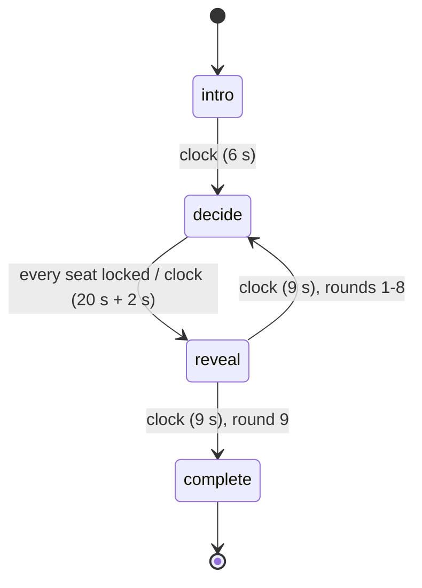

# FIND THE PRIME

> Given an NBA player and a peak length, choose the strongest contiguous
> stretch of his career.

Mode id `find_the_prime` · ruleset `find_the_prime_v1` · board
`find_the_prime_board_v1` · bot policy `find_the_prime_bot_v1` · data
`career_windows.v1` (PEAK3 `peak3-v1`).
Architecture: [ADR-006](../architecture/ADR-006-prime-modes-additive.md).

## Rules as shipped

- Four seats. Humans come through the Arena lobby; bots fill the rest and are
  labelled **Bot · tier**.
- **Nine rounds**: exactly three 2-year, three 3-year and three 5-year prompts,
  in a seeded order. There is no repeated player, and every seat gets the same
  prompts in the same order.
- Each round shows the player, the required length, the career span and a
  **season rail** of every PEAK3-rated season, with team labels. Seasons the
  player did not qualify in appear as a break in the rail. Nothing on the rail
  encodes a score.
- The player places a window by tapping a season (or with the Earlier/Later
  buttons, or the arrow keys), then **locks** it. The bracket only lands on a
  legal start: exactly N consecutive rated seasons.
- Decision window: **20 s**, plus the 2 s action grace. A placed but unlocked
  window is staged privately on the server and **locked for the player** when
  the clock runs out (`staged_at_timeout`). With nothing placed, the round
  scores **0** (`no_selection`). The best window is never chosen on anyone's
  behalf.
- Seats see that another seat has **locked**, never where.
- Every round, including the ninth, then gets a real **reveal**: the career's
  window scores as a ridge, PEAK3's highest-rated window, every seat's window,
  and round points.
- Highest total out of **900** wins. Conceding follows the Prime Cut rules.

## State machine



## Scoring

```
best   = canonical prime_score of the player's highest-rated N-year window
regret = best - chosen window's prime_score        (display points, >= 0)
scale  = clamp(best - worst window, P10, P75 of that spread over the eligible pool)

round  = 100                                   if regret <= 0.65   ("found the prime")
       = 100 * max(0, 1 - regret / scale)      otherwise
no answer = 0, with regret = best - worst (the most a round can cost)
match  = sum of nine rounds (max 900)
```

- **Closeness in canonical score, not start-year distance.** Two neighbouring
  windows the model rates almost equally score almost equally.
- **Equivalence band 0.65:** the p90 gap between adjacent players on the
  committed 2Y/3Y/5Y boards is 0.647 / 0.518 / 0.675. A regret inside it is a
  smaller distinction than the model draws between neighbours nine times in
  ten, so it earns full marks.
- **Clamped scale:** a single outlier season (a rookie year or a comeback)
  cannot make every other window nearly free, and a narrow career cannot turn a
  two-point regret into a cliff. The bounds are derived from the artifact by
  `pool.scale_bounds` and pinned in tests:

| Duration | Eligible prompts | Scale P10 | Scale P75 |
|---|---|---|---|
| 2Y | 118 | 20.47 | 38.56 |
| 3Y | 110 | 13.42 | 31.67 |
| 5Y | 76 | 9.59 | 26.41 |

Behaviour measured on the eligible pool:

- a window one season off the best scores a median 89–91;
- two seasons off scores 62–78;
- the career's median window scores 60–69;
- rookie and decline windows score about 0;
- a uniformly random legal window averages 57.8;
- 11–27 % of adjacent windows fall inside the equivalence band.

Placement: total, then more found primes, then **lower** total regret, then a
shared placement. Speed is never an input. Result `detail`: `total`,
`max_total`, `exact_windows`, `total_regret`, `average_regret`,
`rounds_scored`, `rounds_answered`, `forfeited`, `bot_tier`, `ended_by` and
versions.

## Which prompts are asked

Source: `nba_peak/find_the_prime/pool.py`. A (player, duration) prompt is
eligible only if all of these hold:

- the career is fully inside the scored data (`career_fully_covered`), so a
  player whose prime may predate 1979-80 is never asked where it was;
- the player's best window ranks ≤ **150** on that duration's committed board;
- there are at least **6 / 5 / 4** windows (2Y / 3Y / 5Y) to choose from;
- **best − median window ≥ 3.0**, so the career genuinely varies. This rule
  excludes careers PEAK3 rates as near-flat, such as Michael Jordan (3Y windows
  span 92.75–95.54).

A dealt round writes every window's score, the best window, the equivalent
windows, the floor and the scale into the snapshot, so a historical match is
scored by the numbers it was dealt.

## Bots

`nba_peak/find_the_prime/bot.py`.

- **What a bot sees:** the current prompt and, for bot seats only, the current
  round's window scores. Nothing from a future round appears
  (`test_a_bot_pick_does_not_change_when_only_future_rounds_change`).
- **How it chooses:** it reads each window as its score plus an error that is
  **correlated along the career** (AR(1), ρ 0.7) and scaled by the tier's
  noise, then locks the highest read. Correlated error means a weak bot
  misplaces the prime by a plausible stretch rather than picking random
  seasons. A Rotation bot lands measurably closer to the best start than a coin
  flip does.
- **Tiers and ratings:** seeded per seat, with the tier's rating pinned on the
  seat.

| Tier | Noise σ | Mean round points | Found prime | Mean total /900 | Pinned rating |
|---|---|---|---|---|---|
| Rotation | 30 | 69.8 | 23 % | 628 | 1030 |
| Starter | 18 | 77.3 | 29 % | 695 | 1200 |
| All-Star | 12 | 83.4 | 37 % | 750 | 1356 |
| MVP | 8 | 89.2 | 46 % | 803 | 1570 |

Measured in 600 seeded four-tier matches. The first draft of the noise
(1.5–9) let an MVP bot find the exact prime 90 % of the time and average 99.3
per round, a table no human could reasonably beat. That draft was replaced
before shipping. Head to head, MVP beats Rotation 0.96 of the time, Starter
0.89 and All-Star 0.76.

Think time: Rotation 4–11 s, Starter 5–12 s, All-Star 5.5–13 s,
MVP 6–14 s, seeded per (seat, turn).

## Duration

The intro is 6 s and each of the nine reveals is 9 s. A round resolves when the
slowest seat locks: against bots that is typically 8–14 s, and 22 s at most.
Expected match length is about 3–4 minutes, and at most about 4¾ minutes.

## Data dependencies, telemetry, rollout

- Data: `data/game/prime_modes/career_windows.v1.json` (see
  `nba_peak/prime_modes/build.py`).
- Telemetry (`TELEMETRY.md` §2): `arena_round_started` (round),
  `arena_decision` (`stage` for the first placement, `move`, `lock`),
  `arena_timeout` (`none` or `staged`), `arena_round_completed` (points after
  the reveal), plus the shared match events.
- Rollout: `PEAK3_ARENA_FIND_THE_PRIME_ENABLED` (default off), independent of
  Prime Cut.

## Test matrix

| Layer | File | Covers |
|---|---|---|
| Rules | `tests/find_the_prime/test_pool_and_board.py` | eligibility, excluded near-flat and truncated careers, pinned scale bounds, derived equivalence band, 9 rounds as 3/3/3 with no repeats, seeded order, self-contained rounds |
| Rules | `tests/find_the_prime/test_scoring.py` | exact 100, tied band, mistimed window, clearly wrong window, monotone with no cliffs, degeneracy, no-answer regret, tie-breaks, /900 |
| Rules | `tests/find_the_prime/test_state.py` | nine observable reveals, final reveal before completion, legal windows only, lock finality, staged-at-timeout, silent seat scores 0, staging reset, forfeit, purity, replay, leak tests |
| Rules | `tests/find_the_prime/test_bot.py` | tier ordering, beatable MVP, plausible misses, determinism, future blindness, ratings |
| API | `apps/api/tests/test_arena_find_the_prime.py` | contract and ratings, timed simultaneous decide with no scores, private staging and timeout lock, no-selection zero, grace, rejection codes, reconnect, full match with versioned /900 results, bot replay |
| Web | `apps/web/src/tests/unit/find-the-prime-room.test.tsx` | tap mapping, gaps, arrows, buttons, locked rail, no ridge pre-reveal, debounced stage plus lock payload, reload restore, reveal receipt, result |
| E2E | `apps/web/src/tests/e2e/find-the-prime.spec.ts` | full match with nine reveals and all lengths, rematch, reload restore, silent round, phone rail and ridge, axe |
