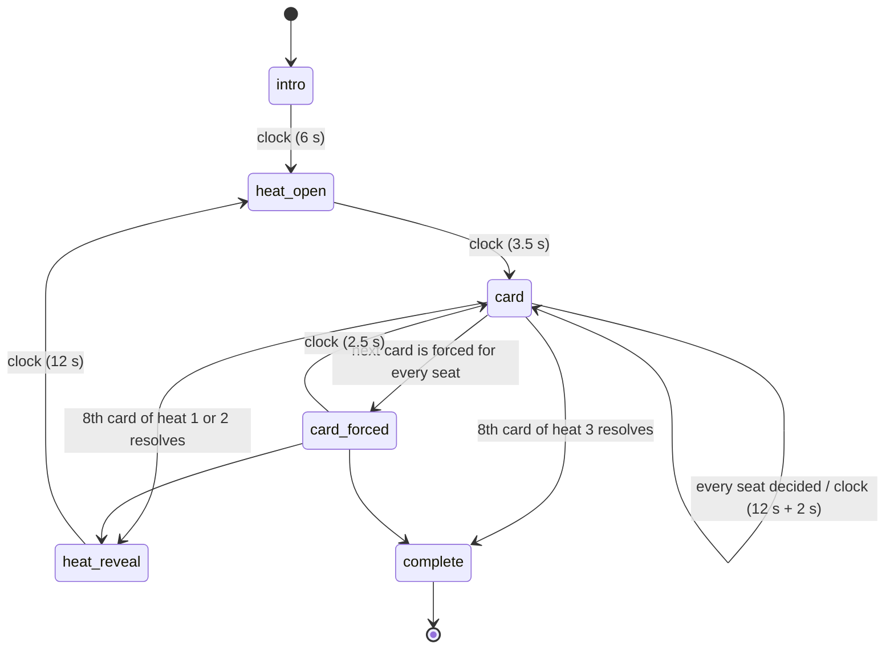

# PRIME CUT

> Eight peaks enter. Keep four. Cut four. Decisions are irreversible.

Mode id `prime_cut` · ruleset `prime_cut_v1` · board `prime_cut_board_v1` ·
bot policy `prime_cut_bot_v1` · data `career_windows.v1` (PEAK3 `peak3-v1`).
Architecture: [ADR-006](../architecture/ADR-006-prime-modes-additive.md).

## Rules as shipped

- Four seats. Humans take seats through the Arena lobby (practice, private
  room, public queue); bots fill the rest and are labelled **Bot · tier**.
- Three heats, in order: **2-year**, **3-year**, **5-year** peaks.
- Each heat deals **eight** cards, one at a time. Every seat sees the same card
  at the same time. A card shows the player, the exact window
  (`2011-12 → 2013-14`), the duration in words and each season's team
  ("2+ teams" for a traded season). It never shows a PEAK3 number.
- Each seat keeps **exactly four** and cuts **exactly four** per heat. A call is
  final the moment it is made.
- Once a seat's four keeps are used, its remaining cards are **forced cuts**
  (and vice versa). A forced call is recorded when the card is dealt, marked
  `forced`, and shown on the card.
- Decision window: **12 s**, plus the foundation's 2 s action grace. A seat
  that runs out the clock **cuts** the card if it still has a cut, otherwise
  **keeps** it (`auto: timeout`). The rule never depends on the card.
- Seats see that another seat has **locked**, never what it chose, until the
  heat resolves.
- After heats 1 and 2 a **heat reveal** shows all eight cards in PEAK3's order,
  the cut line, every seat's keeps and the heat scores. Heat 3 ends the match.
- Conceding places a seat below everyone who played on; if no human is left
  playing the match ends immediately.

## State machine



Every node is a real server turn (`apps/api/app/services/prime_cut/mode.py`).
Nothing a player should see is created and resolved inside one reducer call.
Every turn is seatless: cards are simultaneous decisions (with
`simultaneous_action_grace`), and the ceremonies accept no action.

## Scoring

```
optimal_total = sum of the heat's four highest canonical prime_scores
floor_total   = sum of its four lowest
kept_total    = sum of this seat's four keeps
heat_capture  = 100 * (kept_total - floor_total) / (optimal_total - floor_total)
match_score   = mean(heat_capture over heats played)
```

- Exactly four keeps means `0 ≤ heat_capture ≤ 100` with no clamping.
- The mean of captures (not of raw totals) keeps 2Y, 3Y and 5Y equal. Each
  heat is normalised to its own range.
- Placement: match score, then optimal keeps across all heats, then captured
  value (`Σ kept_total / Σ optimal_total`), then a shared placement (competition
  ranking: 1, 2, 2, 4). Speed is never an input.
- Result `detail`: `heat_2y`, `heat_3y`, `heat_5y`, `optimal_keeps`,
  `captured_ratio`, `match_score`, `forfeited`, `bot_tier`, `ended_by` and the
  ruleset, board, artifact and model versions.
- The receipt names the **best call** (the correct call closest to a cut line)
  and the **costliest cut** (the highest-rated top-four card cut).

## Board generation

Source: `nba_peak/prime_cut/board.py`. A card is the player's **canonical best
window** at that duration (the same row as `leaderboards/top_250_{n}_year_prime.csv`),
from a career fully inside the scored data, ranked ≤ **150** on that board.
Pool size: 134 cards per duration.

Per heat, deterministic from `prime_cut:{seed}:heat:{h}:attempt:{k}`:

1. Place a target cut score uniformly between the 15th and 85th percentile of
   the pool.
2. Draw eight cards without replacement, Gaussian-weighted (σ 8) around it,
   excluding every player already dealt this match.
3. Accept only if the heat passes `heat_quality`:

| Gate | Threshold | Why |
|---|---|---|
| Cut line | 4th − 5th ≥ **1.0** display pts | The p90 gap between adjacent players on the committed 2Y/3Y/5Y boards is 0.647 / 0.518 / 0.675. The right cut must be a bigger distinction than the model draws between neighbours nine times in ten. |
| Capture spread | top four − bottom four ≥ **12** | A meaningful denominator (3 pts per swap on average). |
| Closeness | ≥ **4** cards within **6** pts of the line | A real decision near the line. |
| Marquee cap | ≤ **3** cards ranked ≤ 20 | Eight superstars make four calls free. |
| Uniqueness | no repeated player in the heat or the match | |

4. Shuffle the deal order on the same stream, so order carries no information.

Measured over 1,000 seeds: **0 failures**, mean 1.1–1.2 re-draws per heat
(p95 4–5, max 10); median cut-line gap 2.2; median capture spread 38–40; the
optimal four are "rank-separable" (every keep ranked 40+ places above every
cut) in only 1.5–2.2 % of heats. `tests/prime_cut/test_board.py` re-checks
1,500 seeds and re-derives the cut-line bound from the artifact metadata.

## Bots

`nba_peak/prime_cut/bot.py`, registered for `prime_cut`.

- **What a bot sees:** its `SeatView` only. For a bot seat the projection adds
  the current card's score and the scores of cards already dealt this heat.
  Undealt cards are not in the projection, so they cannot influence a call
  (`test_a_bot_decision_does_not_change_when_only_undealt_cards_change`).
- **How it decides:** each read is the true score plus Gaussian noise of the
  tier's size. It keeps a card if the expected number of better cards still to
  come, from a prior over generated heats shifted toward what this heat has
  shown, is below `keeps_left − 0.5`. A forced card is taken without a read.
- **Tiers:** seeded per seat (`bot_tier_for`); four seats get four distinct
  tiers. Each seat pins its tier's rating (`bot_seat_rating`).
- **Determinism:** every draw uses the driver's seeded RNG, so replaying the
  same seed reproduces the same bot calls.

| Tier | Noise σ | Mean heat capture | Perfect heats | Pinned rating |
|---|---|---|---|---|
| Rotation | 10 | 70.1 | 7.4 % | 1059 |
| Starter | 6 | 75.4 | 13.3 % | 1200 |
| All-Star | 3.5 | 78.9 | 16.6 % | 1303 |
| MVP | 1.8 | 82.6 | 23.9 % | 1388 |
| *(coin flip)* | — | 49.6 | 1.9 % | — |

Ratings are fitted from 500 seeded four-tier matches. Pairwise placement win
rates were converted to Elo gaps and least-squares fitted with Starter anchored
at 1200. Head to head, MVP beats Rotation 0.88 of the time, Starter 0.73 and
All-Star 0.62.

Think time: Rotation 2.0–5.5 s, Starter 2.5–6.5 s, All-Star 3.0–7.5 s,
MVP 3.0–8.0 s, seeded per (seat, turn).

## Duration

Ceremonies total about 45 s (intro 6 s, three slates of 3.5 s, two reveals of
12 s). A card resolves when the slowest seat decides: against bots that is
typically 4–8 s, and 14 s at most. Expected match length is about 3½–4½
minutes, and at most about 6½ minutes. Measured timings are in the PEAK3 QA
record for this pass.

## Data dependencies

- `data/game/prime_modes/career_windows.v1.json`, built by
  `scripts/build_prime_windows.py` and checked in CI
  (`build-web-data.sh --check`).
- The dealt board, including every card's score, is written into the match
  snapshot. A historical match never re-reads a number a later artifact might
  move.

## Telemetry

See `docs/implementation/TELEMETRY.md` §2. Events: `game_opened`,
`arena_match_started`, `arena_round_started` (heat), `arena_prompt_shown`
(card), `arena_decision` (keep, cut, forced), `arena_timeout`,
`arena_round_completed` (heat score after reveal), `arena_match_completed`,
`arena_rematch`, `arena_match_abandoned`.

## Rollout

`PEAK3_ARENA_PRIME_CUT_ENABLED` (default off; requires `PEAK3_ARENA_ENABLED`).
When off, the mode is left out of `/arena/readiness`, so the lobby, `/arena` and
the homepage show no card. Every entry path answers `403 mode_not_enabled`. A
match already in progress keeps working. The direct route
`/arena/prime-cut/{id}` exists regardless.

## Test matrix

| Layer | File | Covers |
|---|---|---|
| Rules | `tests/prime_cut/test_board.py` | determinism, quality gate on 1,500 seeds, derived thresholds, canonical parity, deal-order independence, impossible-constraint failure |
| Rules | `tests/prime_cut/test_scoring.py` | capture formula, mean of heats, tie-break order, forfeits, draws |
| Rules | `tests/prime_cut/test_state.py` | phase sequence, observable reveal, quotas, forced and all-forced cards, rejection codes, timeout rule, forfeit, purity, replay, value-level leak tests for human and bot projections |
| Rules | `tests/prime_cut/test_bot.py` | tier ordering, not perfect, determinism, future blindness, forced cards, seeded tiers, rating order |
| API | `apps/api/tests/test_arena_prime_cut.py` | contract, tiered seats and ratings, timed ceremonies, HTTP and event leak search, locked-not-chosen, irreversibility and bad commands, grace plus timeout rule, reconnect, full match with versioned results, bot replay, concede |
| API | `apps/api/tests/test_arena_prime_hooks.py` | foundation hooks and rollout flags |
| Web | `apps/web/src/tests/unit/prime-cut-room.test.tsx` | card without score, one command per press, stale retry only on the same card, quotas, K/C, forced stamp, intro without skip, cut line, result bands and podium, rematch |
| E2E | `apps/web/src/tests/e2e/prime-cut.spec.ts` | full match with forced calls, reveals and rematch; reload mid-heat; two humans in a private room; phone layout and axe |
