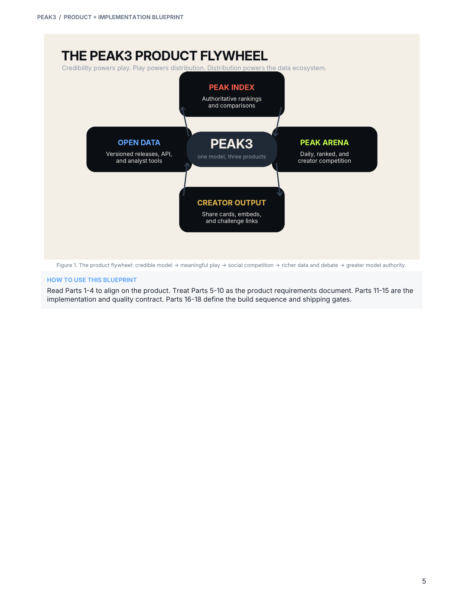
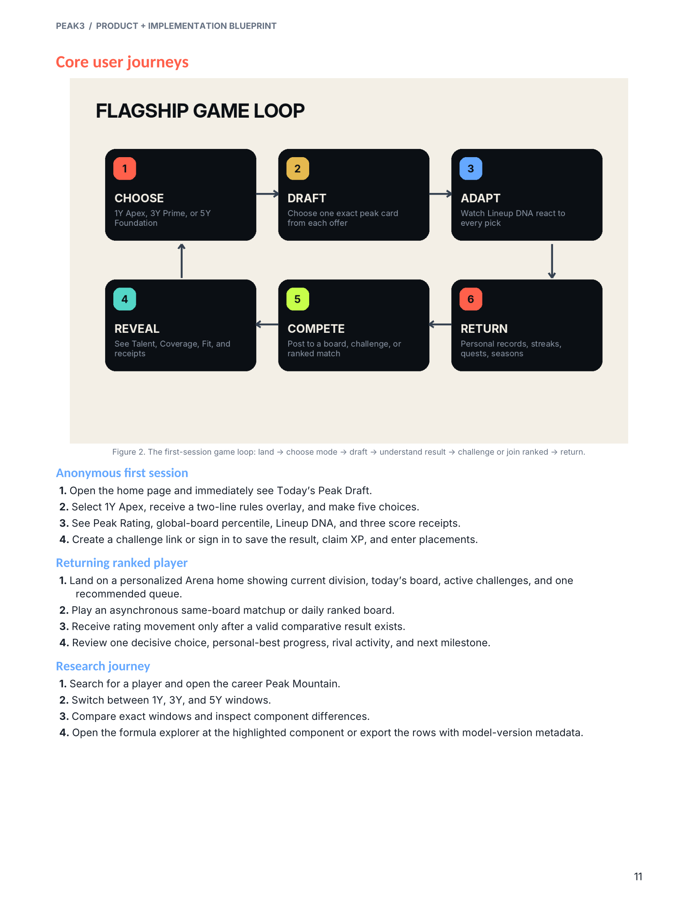
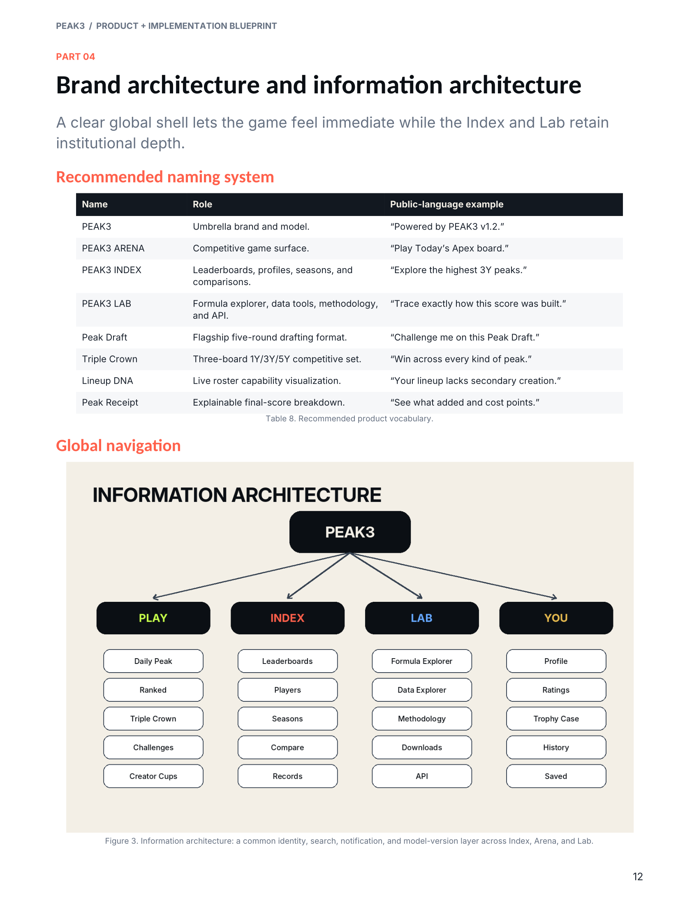
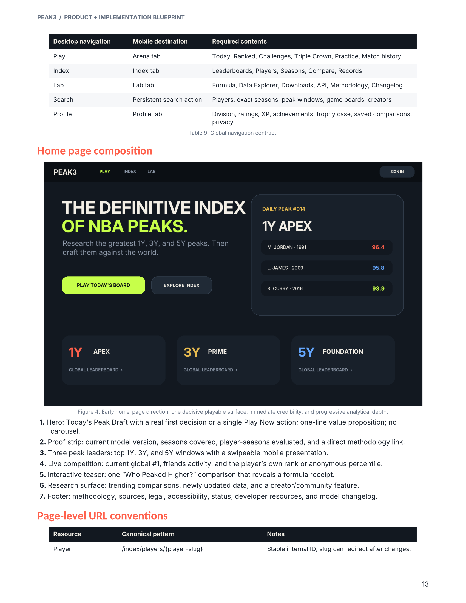
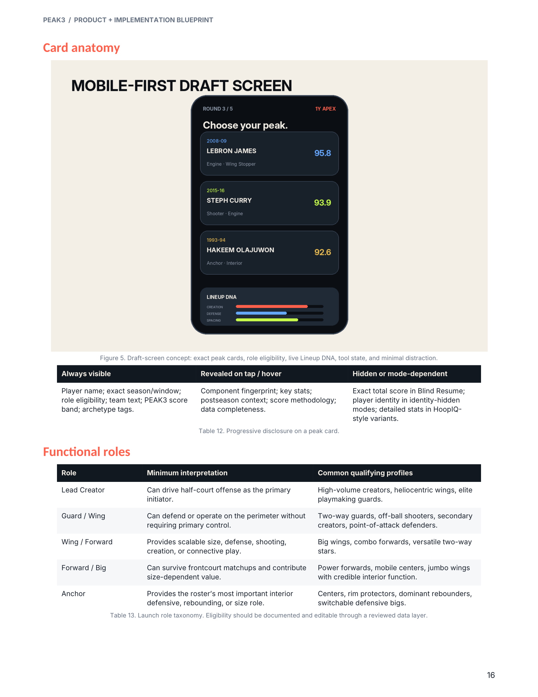
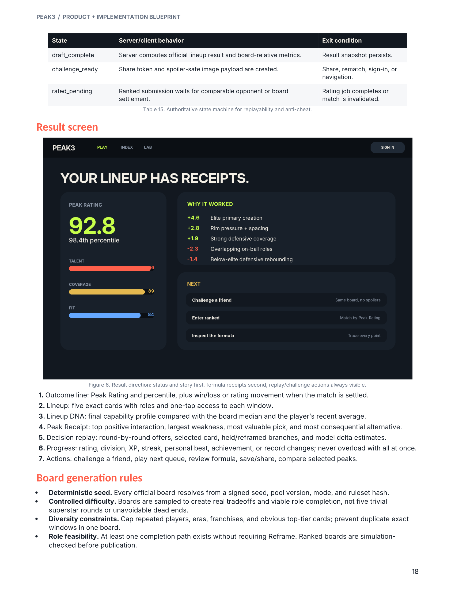
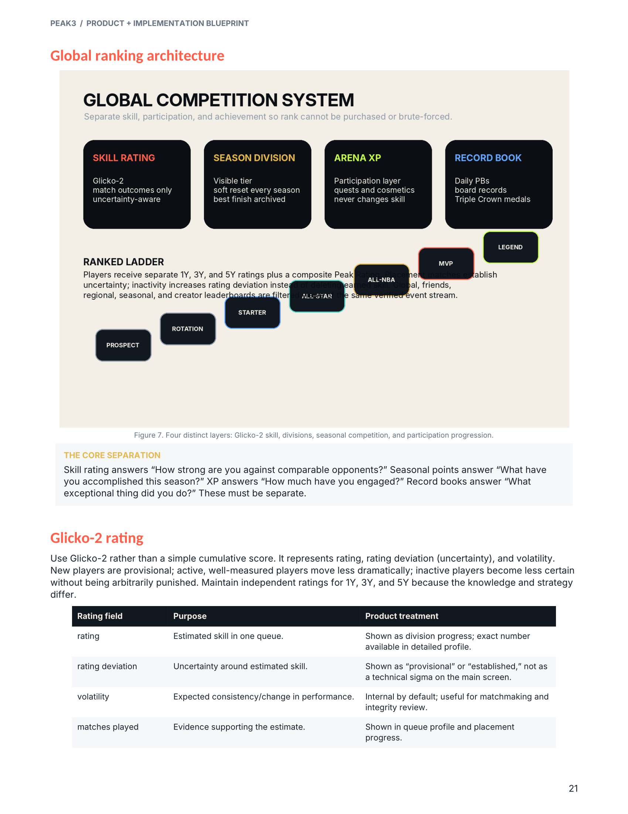
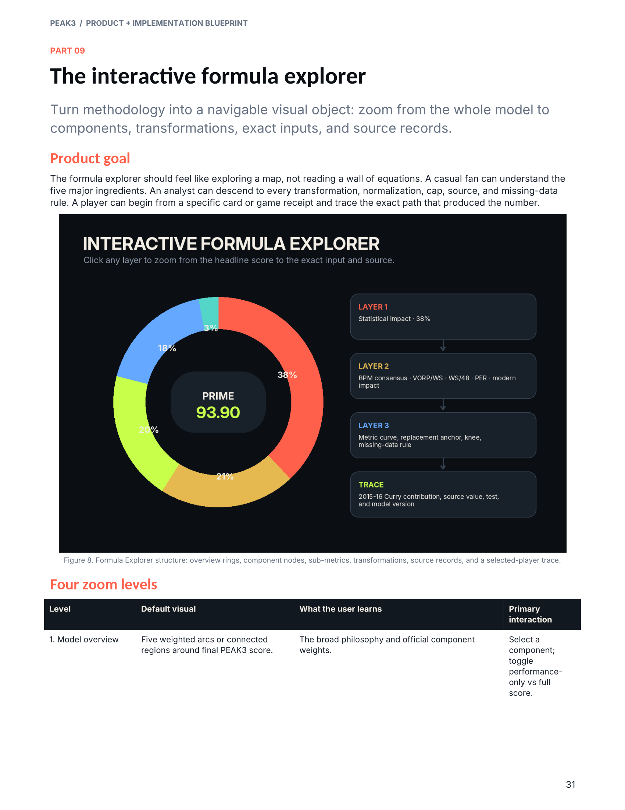
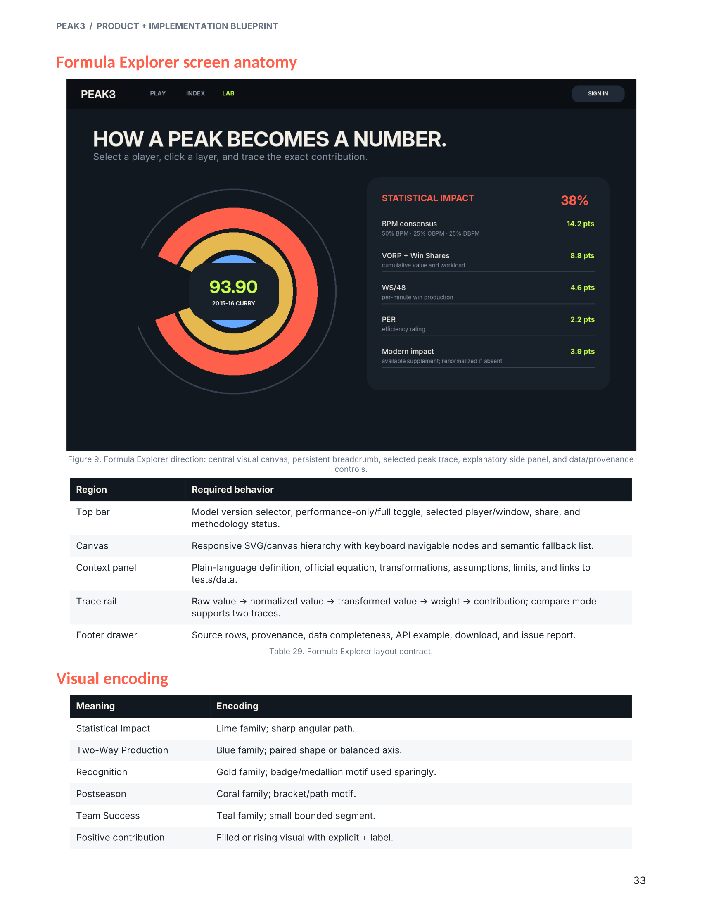
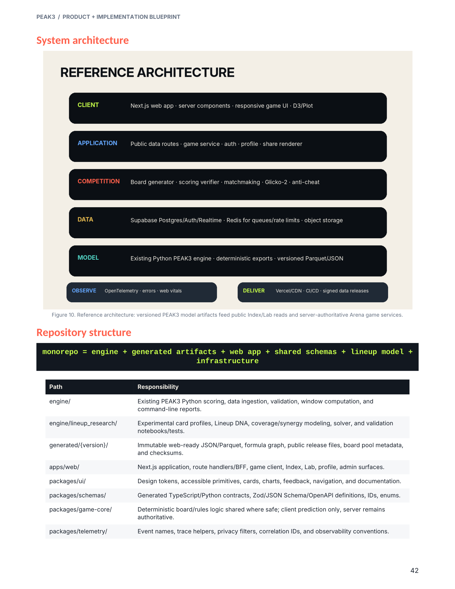

# PEAK3 Product Blueprint Index

The complete product and implementation plan is:

- [`PEAK3_Product_Implementation_Blueprint.pdf`](PEAK3_Product_Implementation_Blueprint.pdf)

The PDF is the full product vision. The current code, schemas, tests, phase reports, and model documentation remain authoritative for implemented behavior.

## Product structure

PEAK3 has three connected surfaces:

- **PEAK3 INDEX** — rankings, players, peak windows, comparisons, and public data
- **PEAK3 ARENA** — Peak Draft, Peak Duel, daily boards, challenges, and future competition
- **PEAK3 LAB** — methodology, formula exploration, provenance, and developer tools

Peak Draft is the flagship gameplay loop. Peak Duel is a secondary fast-play mode.

## Key visual references

### Product flywheel — blueprint page 5

### Flagship game loop — blueprint page 11

### Information architecture — blueprint page 12

### Homepage direction — blueprint page 13

### Mobile Peak Draft screen — blueprint page 16

### Peak Draft result screen — blueprint page 18

### Competition and ranking system — blueprint page 21

### Formula Explorer overview — blueprint page 31

### Formula Explorer screen — blueprint page 33

### System architecture — blueprint page 42

## Implementation rule

Before major work involving gameplay, navigation, visual design, formula exploration, competition, data architecture, or product structure:

1. Read the relevant blueprint section.
2. Inspect the corresponding diagram above.
3. Compare the plan with the current implementation and latest phase report.
4. Preserve the blueprint’s product principles without fabricating unavailable basketball data.
5. Document intentional deviations from the blueprint.
